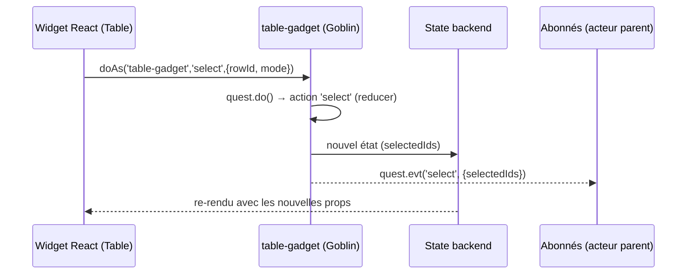

# 📘 goblin-gadgets

## Aperçu

`goblin-gadgets` est la bibliothèque de composants d'interface de l'écosystème Xcraft. Elle regroupe trois choses :

- **Des widgets React** (boutons, champs de saisie, tables, arbres, calendriers, dialogues, horloges, etc.). Ils dérivent tous de `Widget` fourni par [goblin-laboratory], sont stylés en JavaScript et themés par [goblin-theme].
- **Des gadgets** : de petits acteurs Goblin générés par `buildGadget`. Ils portent l'état d'un widget (sélection d'une table, données d'un pivot, etc.) et publient des événements.
- **Des acteurs de navigation et de dialogue** : `stack-navigation`, `tab-navigation`, `popup-dispatcher`, `glyphs-dialog`, `login-dialog`, `wizard`.

Le module embarque aussi un outil de documentation interactive (`widget-doc`) qui explore les propriétés de chaque widget grâce à un système de types déclaratifs (`props.js` + `scenarios.js`).

## Sommaire

- [Aperçu](#aperçu)
- [Structure du module](#structure-du-module)
- [Fonctionnement global](#fonctionnement-global)
- [Exemples d'utilisation](#exemples-dutilisation)
- [Interactions avec d'autres modules](#interactions-avec-dautres-modules)
- [Détails des sources](#détails-des-sources)
- [Licence](#licence)

## Structure du module

```
goblin-gadgets/
├── *.js                     Fichiers racine exposant xcraftCommands (acteurs)
├── builders/                buildGadget (point d'entrée "main" du package)
├── types/                   Système de types des props (stones → PropTypes)
├── test/                    Tests mocha (parseCode)
└── widgets/
    ├── <widget>/            widget.js, styles.js, props.js, scenarios.js
    ├── <acteur>/service.js  Logique des acteurs Goblin/Elf
    ├── helpers/             Utilitaires (géométrie, SVG, combos, etc.)
    └── widget-doc*/         Outil de documentation interactive des widgets
```

**Fichiers racine (acteurs exposés sur le bus Xcraft)**

| Fichier                     | Acteur                   | Type                                                     |
| --------------------------- | ------------------------ | -------------------------------------------------------- |
| `calendar-boards-gadget.js` | `calendar-boards-gadget` | Gadget (Goblin)                                          |
| `demo-gadget.js`            | `demo-gadget`            | Gadget (Goblin)                                          |
| `pivot-gadget.js`           | `pivot-gadget`           | Gadget (Goblin)                                          |
| `table-gadget.js`           | `table-gadget`           | Gadget (Goblin)                                          |
| `tree-gadget.js`            | `tree-gadget`            | Gadget (Goblin)                                          |
| `glyphs-dialog.js`          | `glyphs-dialog`          | Goblin (`widgets/glyphs-dialog/service.js`)              |
| `login-dialog.js`           | `login-dialog`           | Goblin (`widgets/login-dialog/service.js`)               |
| `popup-dispatcher.js`       | `popup-dispatcher`       | Goblin (`widgets/popup-dispatcher/service.js`)           |
| `stack-navigation.js`       | `stack-navigation`       | Goblin (`widgets/stack-navigation/service.js`)           |
| `wizard.js`                 | `wizard`                 | Goblin (`widgets/wizard/service.js`)                     |
| `tabNavigation.js`          | `tab-navigation`         | **Elf** (`Elf.birth(TabNavigation, TabNavigationLogic)`) |

Le `package.json` déclare `config.xcraft.commands = true` : [xcraft-core-server] détecte donc ces fichiers au démarrage et [xcraft-core-bus] charge leurs commandes. `hot: false` désactive le rechargement à chaud.

## Fonctionnement global

### Le couple widget + gadget

Un widget « connecté » lit son état dans le state backend d'un acteur (via `static get wiring()` ou `Widget.connect`). Il déclenche des quêtes avec `this.doAs('table-gadget', 'select', {...})`. Un gadget est donc un acteur minimaliste dont les mutations d'état sont décrites par des fonctions pures (style Redux).



### `buildGadget(config)`

La fonction de `builders/gadget.js` fabrique un Goblin nommé `<name>-gadget`.

- **Quête `create(desktopId, options)`** : crée récursivement les gadgets enfants déclarés dans `gadgets` (via `common.createGadgets` de `goblin-workshop`). Elle initialise l'état avec `{id, childrenGadgets, ...initialState}`, puis dispatche `configure` si `options` est fourni. Enfin, elle émet l'événement `create` si `events.create` existe, et retourne l'id.
- **Une quête par action** déclarée dans `actions` : elle exécute `quest.do()` (appel du reducer homonyme), puis, si `events[action]` existe, publie un événement du même nom dont le payload est calculé par `events[action](state, $msg)`.
- **Gadgets enfants** : pour chaque `onActions` d'un gadget enfant, une quête `jsify('<clé>-<handler>')` est enregistrée. Elle appelle le handler et fait un `quest.me.update()`.
- **Quête `delete`** : vide.

### Navigation

- `stack-navigation` gère une pile d'écrans (`open`, `back`, `replace`) avec animations optionnelles, et crée/détruit les services associés aux écrans.
- `tab-navigation` (Elf) gère des onglets. Chaque onglet instancie paresseusement son service au premier affichage.
- `popup-dispatcher` affiche une popup à la fois parmi une liste déclarée côté widget et permet d'attendre sa fermeture (`prompt`).

## Exemples d'utilisation

### Créer un gadget de table (acteur Goblin)

`table-gadget` est un acteur **Goblin** (pas Elf), on utilise donc le système de quêtes :

```javascript
// Dans une quête d'un acteur Goblin
const tableId = `table-gadget@${quest.uuidV4()}`;
yield quest.create('table-gadget', {id: tableId, desktopId});
yield quest.me.setData; // (illustratif) – l'action se lance via quest.cmd :
yield quest.cmd('table-gadget.setData', {id: tableId, data: tableData});
```

Côté interface, le widget lie le gadget :

```jsx
import Table from 'goblin-gadgets/widgets/table/widget';

<Table
  id={tableId}
  data={data}
  selectionMode="multi"
  frame={true}
  hasButtons={true}
/>;
```

Le gadget publie ensuite `select` avec `{selectedIds: [...]}` à chaque changement de sélection.

### Onglets avec `TabNavigation` (acteur Elf)

```javascript
const {
  TabNavigation,
} = require('goblin-gadgets/widgets/tab-navigation/service.js');

const tabs = new TabNavigation(this);
await tabs.create(`tab-navigation@${this.uuid()}`, desktopId, {
  clients: {service: ClientList, widget: 'client-list'},
  factures: {
    service: InvoiceList,
    serviceArgs: [{year: 2024}],
    widget: 'invoice-list',
  },
});
await tabs.setTab('factures');
```

```jsx
import {TabNavigation} from 'goblin-gadgets/widgets/tab-navigation/widget';

<TabNavigation
  id={tabsId}
  widgets={{'client-list': ClientList, 'invoice-list': InvoiceList}}
/>;
```

`Ctrl+§` passe à l'onglet suivant, `Ctrl+°` à l'onglet précédent.

### Popup modale avec attente du résultat

```javascript
// quête Goblin : ouverture d'une popup et attente de sa fermeture
const result = yield quest.cmd('popup-dispatcher.prompt', {
  id: popupDispatcherId,
  popup: 'confirm-delete',
  params: {name: 'Facture 2024-12'},
});
```

La popup se ferme avec `hide({result})`, ce qui publie `<confirm-delete.done>`.

### Boutons et champs

```jsx
import Button from 'goblin-gadgets/widgets/button/widget';
import TextFieldTyped from 'goblin-gadgets/widgets/text-field-typed/widget';

<Button kind="action" glyph="solid/check" text="Valider" place="1/2" onClick={save} />
<TextFieldTyped type="date" model=".dueDate" width="140px" />
```

## Interactions avec d'autres modules

- [goblin-laboratory] : classe `Widget`, `Form`, helpers de connexion (`withC`, `C`, `stateMapperToProps`), `Frame`.
- [goblin-theme] : `Unit`, `ColorManipulator`, `ColorHelpers`, palette/shapes consommés par tous les `styles.js`.
- [goblin-nabu] : traduction (`T`, `TranslatableDiv`, `TranslatableInput`, etc.) et messages des `translatable-text-field`.
- [goblin-toolbox] : `CronHelpers` (calendar-recurrence) et `SchemaHelpers` (widget `field`).
- [goblin-workshop] : `common.createGadgets` (gadgets enfants) et `buildWorkitem` (`glyph-detail`). Ce module n'est pas déclaré dans les dépendances du `package.json`.
- [goblin-wm] : `moveToFront` appelé par `popup-dispatcher` (échec toléré hors Electron).
- [xcraft-core-goblin] : `Goblin`, `Elf` (acteurs).
- [xcraft-core-stones] : types (`Type`, `enumeration`, `union`…) pour les props et les shapes.
- [xcraft-core-shredder] : état immutable (reducers de `table`, `hinter-field`, etc.).
- [xcraft-core-converters] : conversions/formatage (date, heure, prix, couleur…).
- [xcraft-core-utils] : `jsify` (noms de quêtes de gadgets).
- [xcraft-core-server] et [xcraft-core-bus] : chargement des `xcraftCommands`.

## Détails des sources

### `builders/builders.js` et `builders/gadget.js`

Point d'entrée du package (`main`) : exporte `buildGadget`. Le fonctionnement est décrit dans [Fonctionnement global](#fonctionnement-global).

Configuration acceptée : `{name, initialState, actions, events, gadgets}`.

- `actions` : `{nom: (state, action) => state}` (reducers).
- `events` : `{nom: (state, $msg) => payload}`.
- `gadgets` : gadgets enfants, avec `onActions` optionnel.

### Gadgets (fichiers racine)

#### `table-gadget.js`

Gère la sélection et les données d'une table.

**État et modèle de données**

- `data` : définition de la table (header, rows…).
- `selectedIds` : tableau des ids de lignes sélectionnées.
- `sortedRows` : lignes triées/aplaties (utilisée par `selectAll`).

**Actions et événements**

- **`setData(data)`** — remplace `data`.
- **`syncSelect(selectedIds)`** — force la sélection (événement `syncSelect`).
- **`select(rowId, mode)`** — `mode='multi'` bascule la ligne, `single` (défaut) sélectionne ou désélectionne. Événement `select`.
- **`deselect(rowId)`**, **`deselectAll()`**, **`selectAll()`**.
- **`doubleClick(rowId)`** — sans effet d'état. L'événement `doubleClick` publie `{rowId}`.

#### `tree-gadget.js`

Même principe pour l'arbre.

- **`setData(data)`**, **`select(rowId, mode)`** (`single` ou `multi`, sinon `Error('Unknow mode …')`), **`selectAll()`** (ids dédupliqués), **`deselectAll()`**.
- **`doubleClick(rowId)`** — contient un `TODO` (non implémenté).
- Événements : `select`, `selectAll`, `deselectAll` (payload `{selectedIds}`).

#### `calendar-boards-gadget.js`

- **État** : `boards`, `visibleDate`, `selectedDate`, `selectedBoardId`.
- **Actions** : `configure(visibleDate)`, `setData`, `showDate`, `selectDate`, `selectBoardId`.
- **Événements** : `setData`, `showDate`, `selectDate`, `selectBoardId`, avec l'extrait d'état correspondant.

#### `pivot-gadget.js`

Une seule action : `setData(data)`. Aucun événement.

#### `demo-gadget.js`

Gadget d'exemple : `test(value)` stocke `value`.

### Acteurs Goblin des widgets

#### `stack-navigation` (`widgets/stack-navigation/service.js`)

Pile d'écrans avec animations.

**État et modèle de données**

- `id`, `stack` (écrans empilés avec `widget`, `widgetProps`, `serviceId`, `animations`, `count`, `key`).
- `operation` (`open`, `back`, `replace` ou `null`), `operationParams`, `backAnimationId`.

**Cycle de vie** : `create(desktopId, servicesArgs, screens)` mémorise les définitions d'écrans. `delete` est vide.

**Quêtes publiques**

- **`open(screenName, args)`** — résout l'écran (une fonction d'écran peut calculer ses props), crée son service (`serviceId` ou `service@uuid`), puis empile. Ignoré si une opération est en cours. Retourne le `serviceId`.
- **`back(backCount=1, waitEnd, next)`** — dépile `backCount` écrans. Avec animation, attend éventuellement l'événement `back-finished`. Les services des écrans retirés sont tués.
- **`replace(screenName, args, replaceCount=1)`** — remplace les derniers écrans.
- **`endAnimation()`** — appelée par le widget en fin d'animation CSS. Elle finalise l'opération en cours.
- **`endBackAnimation()`**, **`endReplaceAnimation()`** — finalisent l'opération et tuent les services concernés.

Les quêtes préfixées par `_` sont internes (mutations et animations).

**Événement publié** : `back-finished` (`{correlationId}`).

#### `popup-dispatcher` (`widgets/popup-dispatcher/service.js`)

- **État** : `id`, `popup`, `params`.
- **Cycle de vie** : `create(id, desktopId, labId)` s'abonne au feed `desktopId` (branche `id`) via le warehouse.
- **`show(popup, params)`** — ramène la fenêtre au premier plan, puis affiche la popup.
- **`prompt(popup, params)`** — comme `show`, mais attend `*::*<popup.done>` et retourne le résultat.
- **`hide(result={})`** — publie `<popup>.done` puis vide l'état.
- **`setParams(params)`** — fusionne les paramètres.
- **`showWindow()`** — appelle `moveToFront` sur `wm@<labId>` (avertissement si hors Electron).

#### `glyphs-dialog` (`widgets/glyphs-dialog/service.js`)

- **État** : `id`, `allGlyphs`, `selectedGlyphs` (chaque glyphe porte un `order`).
- **Quêtes** : `create(allGlyphs)`, `toggleGlyphs(glyphId)`, `dragGlyphs(fromId, toId)` (calcule un nouvel `order` intercalé), `clearGlyphs()`, `delete`.

#### `login-dialog` (`widgets/login-dialog/service.js`)

Dialogue de connexion de démonstration (comptes codés en dur : **ne pas utiliser en production**).

- **État** : `id`, `user`, `password`, `tryCounter`, `maxTry` (5), `error`, `close`, `login`.
- **Quêtes** : `create(desktopId, login)`, `submit(value)`, `reset()`, `logout()`, `delete`.

#### `wizard` (`widgets/wizard/service.js`)

Maquette de configurateur de widgets (largement remplacée par `widget-doc`).

- **État** : `id`, `globalSettings`, `properties`, `previewSettings`.
- **Quêtes** : `create(desktopId)` ajoute l'onglet « Wizard » au desktop (`addTab`), `delete`.

#### `tab-navigation` (`widgets/tab-navigation/service.js`, Elf)

Acteur **Elf** instanciable.

**État et modèle de données** (`TabNavigationShape`)

- `id`, `currentTab`, `currentServiceId`, `currentWidget`, `currentWidgetProps` (tous typés `string` dans la shape).

**Vues** (`NavigationViews`) : `{[nom]: {service, serviceArgs?, widget, widgetProps?}}`. `service` est une classe Elf.

**Cycle de vie** : `create(id, desktopId, views)` sélectionne le premier onglet. `delete()` est vide. Les services sont créés au premier accès et mis en cache dans `loadedServices`.

**Méthodes publiques**

- **`create(id, desktopId, views)`** — initialise l'état et affiche le premier onglet.
- **`change(path, newValue)`** — modifie une clé de l'état.
- **`setTab(tab)`** — charge le service de l'onglet si nécessaire et le sélectionne (`Error('Unknown tab')` si inconnu).
- **`switchTab(reverse)`** — onglet suivant ou précédent, avec rebouclage.

### Widgets de base

| Widget                                                                                      | Rôle et props notables                                                                                                                                                   |
| ------------------------------------------------------------------------------------------- | ------------------------------------------------------------------------------------------------------------------------------------------------------------------------ |
| `button`                                                                                    | Bouton polyvalent. `kind` (action, menu-item, calendar…), `glyph`, `text`, `shortcut`, `badgeValue`, `busy`, `focusable`, `toAnchor`. Rendu spécifique en thème _retro_. |
| `command-button`                                                                            | `Button` affiché seulement si la commande est autorisée (`canDo`). `showDisabled` pour l'afficher désactivé.                                                             |
| `label` / `label-nc`                                                                        | Texte, glyphe FontAwesome (`solid/…`), Markdown (texte entre ``), `<em>` et backticks pour la mise en évidence.                                                          |
| `label-row`                                                                                 | Étiquette + contenu sur une ligne (`labelText`, `labelWidth`).                                                                                                           |
| `label-text-field`                                                                          | Étiquette + `TextField` auto-readonly hors focus.                                                                                                                        |
| `container`                                                                                 | Conteneur de mise en page (`kind`, `subkind`, `busy`, `trianglePosition`…). Enregistre les contrôleurs de drag & drop.                                                   |
| `separator`, `fragment`, `dialog`, `full-screen`, `colored-container`, `document-container` | Séparateurs, fragment conditionnel (`show`), cadres, fond plein écran, couleur selon valeur 0–100, feuille avec coin plié (SVG).                                         |
| `badge`, `gauge`, `time-gauge`, `spinner`, `smiley`, `triangle`                             | Pastille, jauge (dégradés, `flash`), jauge temporelle (rafraîchie chaque minute), indicateur de chargement, smiley animé, triangle CSS.                                  |
| `markdown`                                                                                  | Rendu `react-markdown` (+ `remark-gfm`, `remark-supersub`).                                                                                                              |
| `tips`                                                                                      | Astuces paginées, rang mémorisé en session utilisateur.                                                                                                                  |
| `accordion`, `animated-container`                                                           | Déploiement animé ; animations nommées (`rightToCenter`, `zoomIn`, `fadeOut`…).                                                                                          |
| `ticket`, `ticket-hover`                                                                    | Tickets « dentelés » SVG (`kind`, `shape`, `hatch`, `hoverShape`, coin coloré).                                                                                          |
| `notification`                                                                              | Notification avec message, jauge de progression et bouton d'extension.                                                                                                   |
| `chat-balloon`, `chat-dialog`                                                               | Bulles de discussion (`type: sended/received`, `look`).                                                                                                                  |

Exemple :

```jsx
<Label kind="title" glyph="solid/rocket" text="Démarrage" />
<Gauge kind="rounded" direction="horizontal" gradient="red-yellow-green" height="12px" value={30} />
```

### Saisie de données

| Widget                                                                                     | Rôle                                                                                                                                                                                                                        |
| ------------------------------------------------------------------------------------------ | --------------------------------------------------------------------------------------------------------------------------------------------------------------------------------------------------------------------------- |
| `text-input-nc`                                                                            | Entrée brute (mono/multiligne, `autoRows`, `onValidate` sur Entrée, glyphe, ballon d'info).                                                                                                                                 |
| `text-input-info-nc`                                                                       | Ajoute un `FlyingBalloon` (`info`, `warning`, fonction `check`).                                                                                                                                                            |
| `input-wrapper`                                                                            | HOC : mémorise la valeur brute et n'expose que la valeur canonique. `changeMode` : `blur`, `throttled`, `immediate`, `passthrough`.                                                                                         |
| `text-field`, `text-field-nc`                                                              | Champ texte avec `format`/`parse`. Variante connectée via `model` ([goblin-laboratory] `withC`).                                                                                                                            |
| `text-field-typed(-nc)`                                                                    | Champs typés : `date`, `time`, `datetime`, `price`, `number`, `integer`, `percent`, `pixel`, `delay`, `color`, etc. Calendrier, horloge ou sélecteur de couleur en combo ; flèches haut/bas pour incrémenter.               |
| `text-field-combo(-nc)`, `button-combo`, `flat-list`, `combo`, `combo-container`, `select` | Listes déroulantes et menus (`menuType: wrap/menu`, `restrictsToList`).                                                                                                                                                     |
| `text-field-date-interval`, `text-field-time-interval`                                     | Intervalles début/fin avec bornes et boutons de période.                                                                                                                                                                    |
| `checkbox(-nc)`, `radio-list`, `check-list`, `flat-combo`, `switch-on-off`                 | Cases, boutons radio, listes à cocher, sélecteurs plats et interrupteur ON/OFF.                                                                                                                                             |
| `slider`, `slider-xy`, `slider-circle`                                                     | Curseurs (simple, double `"20;80"`, 2D, circulaire 0–360).                                                                                                                                                                  |
| `color-picker`                                                                             | Sélecteur HSL / RGB / CMYK / gris / palette, avec dernières couleurs en session.                                                                                                                                            |
| `file-input(-nc)`, `directory-input(-nc)`                                                  | Sélection de fichier(s) ou dossier (`multiple`, `accept`).                                                                                                                                                                  |
| `hinter-field(-nc)`, `hinter`, `hinter-column`                                             | Recherche/sélection d'entités : mode recherche puis mode sélection, avec boutons Créer, Effacer et Voir.                                                                                                                    |
| `translatable-text-field`                                                                  | Champ multilingue ([goblin-nabu]), édition côte à côte de deux locales dans un dialogue redimensionnable.                                                                                                                   |
| `state-browser(-dialog)`                                                                   | Choix d'un champ dans un arbre d'état immutable.                                                                                                                                                                            |
| `field`                                                                                    | Widget « tout-en-un » : choisit le contrôle selon `kind` ou le schéma d'entité ([goblin-toolbox] `SchemaHelpers`). Gère les modes lecture seule et édition, et les kinds `gadget`, `id`, `ids`, `combo-ids`, `hinter`, etc. |

Exemple :

```jsx
<Field model=".name" kind="field" labelText="Nom" />
<Field model=".status" kind="combo" list={['draft', 'published']} />
```

### Tables, arbres, listes

- **`table` / `table-nc`** : tableau avec en-têtes (`post-header` pour regrouper des colonnes), filtre, tri multi-colonnes, sélection `none/single/multi`, lignes hiérarchiques (`rows`), séparateurs, boutons « tout sélectionner ». Le reducer local gère `INITIALISE`, `SORT_COLUMN`, `FILTER`, `SELECT`, `MOVE_SELECTION` (flèches haut/bas avec `useKeyUpDown`). Si `id` est fourni, la sélection est synchronisée avec `table-gadget`. Les cellules (`table-cell`) acceptent texte, glyphe, couleur ou une fonction de rendu.
- **`tree`, `tree-row`, `tree-cell`** : arbre dépliable avec sélection (`tree-gadget`).
- **`table-header-drag-manager`** : redimensionnement et réordonnancement de colonnes par glisser-déposer.
- **`list`** : liste virtualisée (`react-list`) avec cache de scroll en session et récupération par plages (`list.fetch`).
- **`pivot`** : tableau croisé `react-pivottable`, alimenté par `pivot-gadget`.
- **`samples-monitor`** : oscilloscope (thèmes modern et retro) : modes `grouped`, `colored-stack`, `separate` et `all`.
- **`state-monitor`** : explorateur de l'état backend avec historique et copie.

### Calendriers et temps

- **`calendar`** : 1 à 12 mois, `dates` (`add`, `sub`, `base`), `badges`, navigation par molette, combos mois/année, `ItemComponent` personnalisé.
- **`calendar-button`, `calendar-list`, `calendar-recurrence`, `calendar-boards`** : jour, liste des dates, récurrence cron ([goblin-toolbox]) et sélecteur de « boards » par date.
- **`analog-clock`** : horloge analogique (looks `cff`, `classic`, `royal`, `dots`…), heure fixe ou temps réel, synchronisation serveur (`serverTick`), glisser de l'aiguille des minutes.
- **`clock-combo`** : sélecteur d'heure (boutons ±, curseurs verticaux, molette, horloge).

### Dialogues, popups et fenêtres

- **`dialog-modal`** : modale (avec ou sans triangle, option `resizable`, `backgroundClose`). Échap ferme et Entrée ferme sauf si `enterKeyStaysInside`. Gère les touches via `key-trap`.
- **`dialog-resizable(-nc)`** : fenêtre déplaçable et redimensionnable ; rectangle mémorisé en session (`set-dialogs`).
- **`popup-container`, `popup-dispatcher`** : popups plein écran ou ancrées (`attachPoint`, `triangle`).
- **`work-dialog`, `glyphs-dialog`, `login-dialog`, `glyph-detail`** : dialogues applicatifs. `glyph-detail` utilise `buildWorkitem` de [goblin-workshop] et n'est pas exposé via `xcraftCommands`.
- **`flying-balloon`, `dynamic-toolbar`, `resizable-container`, `splitter`** : bulles d'info, barre d'outils escamotable, conteneur à poignées, séparateur redimensionnable (position persistée en session).
- **`key-trap.js`** : remplace MouseTrap pour les touches imbriquées. Seule l'action enregistrée en dernier est exécutée (Échap ferme d'abord le combo, puis la sous-popup, puis la popup).

### Glisser-déposer

`drag-cab` rend un élément déplaçable, et `drag-carrier` dessine l'élément transporté et la cible. Ils s'appuient sur `window.document.dragControllers`, `dragCabs`, `dragParentControllers`, `flyingDialogs` et `viewIds`, enregistrés par `Container` (`dragController`, `dragOwnerId`).

### Carrousel

`carousel`, `carousel-item`, `carousel-button`, `carousel-bullet` : défilement par pages, tactile, `cycling: blocked/loop`.

### Divers et décoratifs

- **`launcher`, `launcher-blob`, `rocket`** : écran de lancement d'applications (fusées et fond animé).
- **`guild-entry`, `guild-user-logo`, `guild-user-profile`** : écrans « guilde » et logo utilisateur (formes `circle`, `hexagon`, `star`… ou photo `uri`).
- **`retro-*`** (`action-button`, `badge-button`, `gear`, `illuminated-button`, `panel`, `screw`) : éléments du thème _retro_ (SVG, engrenages animés, vis).
- **`well-done`** : animation de confettis. Importe `assets/box-back.png` et `box-front.png`.
- **`map`** : carte Leaflet avec marqueurs Maki. Le fournisseur de tuiles est en HTTP.
- **`goblin-editor`** : éditeur Monaco avec formatage Prettier.
- **`widget-doc`, `widget-doc-menu`, `widget-doc-properties`, `widget-doc-property(-control)`, `widget-doc-preview(-container)`** : voir ci-dessous.

### Système de types et documentation (`types/`, `widget-doc`)

- **`types/types.js`** : catalogue de types UI (`pixel`, `color`, `glyph`, `shape`, `nabu`, `percentage`, `horizontalSpacing`, `enumeration(...)`, `union(...)`, etc.), avec `samples` et `widget` d'édition. `addType(name, type)` en ajoute (l'exception « déjà défini » teste `types.name` et non `types[name]`).
- **`types/data-types.js`, `ui-types.js`** : types `nabu` et `component`.
- **`types/props-list.js`** : `propsList({groupe: {prop: {type, description, defaultValue, required, min, max, step}}})` aplatit en liste de props.
- **`types/prop-types.js`** : `makePropTypes` et `makeDefaultProps` convertissent ces définitions en `PropTypes` React. Le type `nabu` accepte chaînes, nombres, objets `nabuId` ou `translatableString/Markdown`.
- **`widgets/widget-doc/widget-list.js`** : `registerWidget(Widget, props, scenarios, useWithWidgetDoc = true)` affecte `propTypes` et `defaultProps`, puis référence le widget dans la documentation interactive.
- **`widget-doc-preview/parse-code.js`** : analyse un fragment JSX (`<Button text="x" width={100}/>`) en objet de props (testé par `test/code-parser.spec.js`). Les valeurs sont évaluées avec `eval` ; il est réservé à l'outil de documentation.

### Fichiers de style (`styles.js`)

Chaque widget exporte `propNames` (props qui influencent le CSS) et une fonction `styles(theme, props)` retournant des objets de style JS. `Widget` les transforme en classes CSS et les expose via `this.styles.classNames`. Certains exportent aussi `mapProps` pour dériver des props booléennes.

### `widgets/helpers/`

- **`combo-helpers.js`** : calcul de position et de déclipping des combos et dialogues.
- **`geom-helpers.js`, `svg-helpers.js`** : géométrie (angles, rotations) et construction de chemins SVG.
- **`spacing-helpers.js`** : marge droite selon `horizontalSpacing`.
- **`shortcut-helpers.js`** : traduit `_ctrl_+A` selon l'OS.
- **`rect-helpers.js`, `table-helpers.js`, `ticketColorPallet.js`** : tests de point dans un rectangle, couleurs de tables, palette de tickets.

## Licence

Ce module est distribué sous [licence MIT](./LICENSE).

_Ce contenu a été généré par IA_

---

[goblin-laboratory]: https://github.com/Xcraft-Inc/goblin-laboratory
[goblin-theme]: https://github.com/Xcraft-Inc/goblin-theme
[goblin-nabu]: https://github.com/Xcraft-Inc/goblin-nabu
[goblin-toolbox]: https://github.com/Xcraft-Inc/goblin-toolbox
[goblin-workshop]: https://github.com/Xcraft-Inc/goblin-workshop
[goblin-wm]: https://github.com/Xcraft-Inc/goblin-wm
[xcraft-core-goblin]: https://github.com/Xcraft-Inc/xcraft-core-goblin
[xcraft-core-stones]: https://github.com/Xcraft-Inc/xcraft-core-stones
[xcraft-core-shredder]: https://github.com/Xcraft-Inc/xcraft-core-shredder
[xcraft-core-converters]: https://github.com/Xcraft-Inc/xcraft-core-converters
[xcraft-core-utils]: https://github.com/Xcraft-Inc/xcraft-core-utils
[xcraft-core-server]: https://github.com/Xcraft-Inc/xcraft-core-server
[xcraft-core-bus]: https://github.com/Xcraft-Inc/xcraft-core-bus
